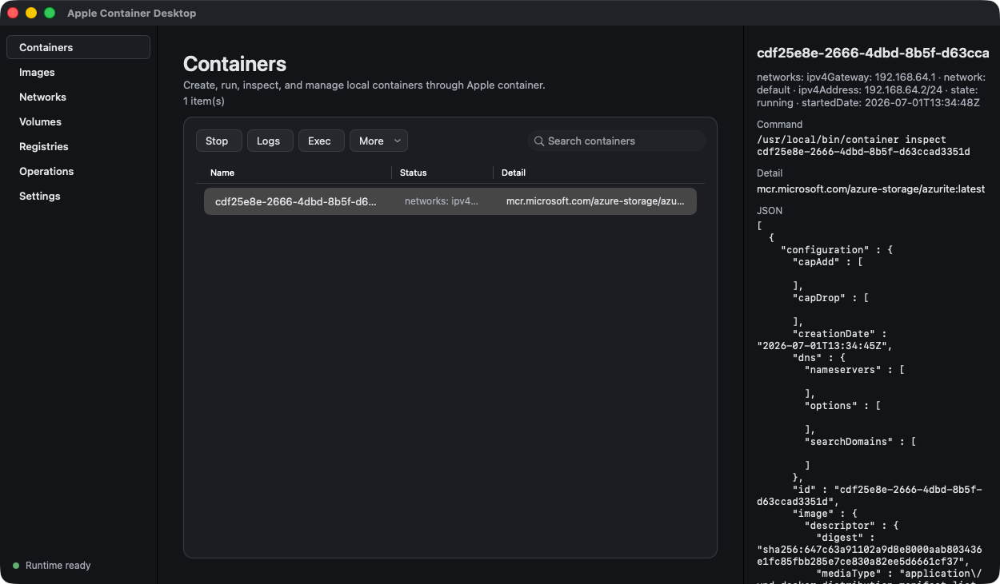
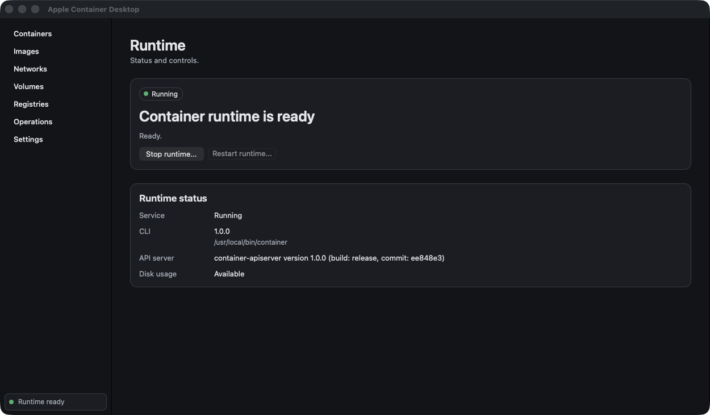

# Apple Container Desktop

Apple Container Desktop は、Apple `container` CLI を macOS ネイティブ GUI から管理するための AppKit 製ユーティリティです。

MVP では system status、初回オンボーディング、containers、images、builds、networks、volumes、registry、machines、settings をローカル操作として扱います。Docker Engine API 互換、`docker` CLI 互換 layer、Kubernetes 管理、外部 telemetry、Apple `container` の fork は含みません。

## スクリーンショット





## 必須環境

- Apple silicon Mac
- macOS 26 以降
- 開発時は Xcode 26 / Swift 6
- Apple `container` CLI は別途インストール

Apple `container` は、Apple が GitHub releases で配布している signed installer package から別途インストールしてください。アプリは PATH、`/usr/local/bin/container`、`/Library/Apple/usr/bin/container`、または Settings の override から `container` を検出します。CLI を自動インストールすることはありません。

## 開発

XcodeGen をインストールしてから、root の Makefile を使います。

```sh
brew install xcodegen
make generate
make build
make test
make run
```

アプリは解決済みの `container` executable を `Process` + argument array で実行します。shell 展開される command string は使いません。

## MVP 実装範囲

- Runtime status: sidebar 下部の compact indicator から開く CLI 検出、system status/version/df、lifecycle controls。
- Resources: containers、images、networks、volumes、registries の検索/ソート可能な object list と JSON inspect。
- Operations: command history、container create/run/start/stop/kill/delete/logs/stats/copy/export/Terminal exec/prune、image pull/build/push/tag/delete/prune、builder start/stop/delete/status、network/volume create/delete/prune、registry login/logout、machine logs/stop/delete/set-default。
- Settings: CLI executable override、検出詳細、service status、read-only runtime properties。

Registry password は `container registry login` の stdin に渡し、command preview には表示しません。アプリは command preview と exit status をローカルに記録しますが、telemetry は収集しません。

## Keyboard shortcuts

| Shortcut | Action |
| --- | --- |
| `⌘R` | 現在の画面を更新 |
| `⌘F` | resource list の検索に focus |
| `⌘1` ... `⌘6` | Containers から Operations までを開く |
| `⌘0` | Runtime Status を開く |
| `⌘,` | Settings を開く |
| `⌘↩` | 選択中 container を start |
| `⌥⌘S` | 選択中 container を stop |
| `⌘L` | 選択中 container の logs を表示 |

## 配布

Release build では ad-hoc signed DMG を作成します。

```sh
make dmg VERSION=0.1.0
```

Developer ID credentials を持つ maintainer は以下を使えます。

```sh
cp .env.example .env
make notarize VERSION=0.1.0
```

ad-hoc build を公開する場合、source を確認したうえで Gatekeeper quarantine 解除が必要になることがあります。

```sh
xattr -dr com.apple.quarantine /Applications/AppleContainerDesktop.app
```

Apple `container` はアプリに同梱しません。Apple の release installer で別途インストール/更新してください。

## 現在の制約

- MVP では外部 `container` CLI とユーザー選択 path を実行するため、App Sandbox は無効です。
- 長時間 operation の progress output は operation result として capture します。よりリッチな streaming progress view は後続です。
- Terminal exec は in-app PTY ではなく macOS Terminal を開きます。
